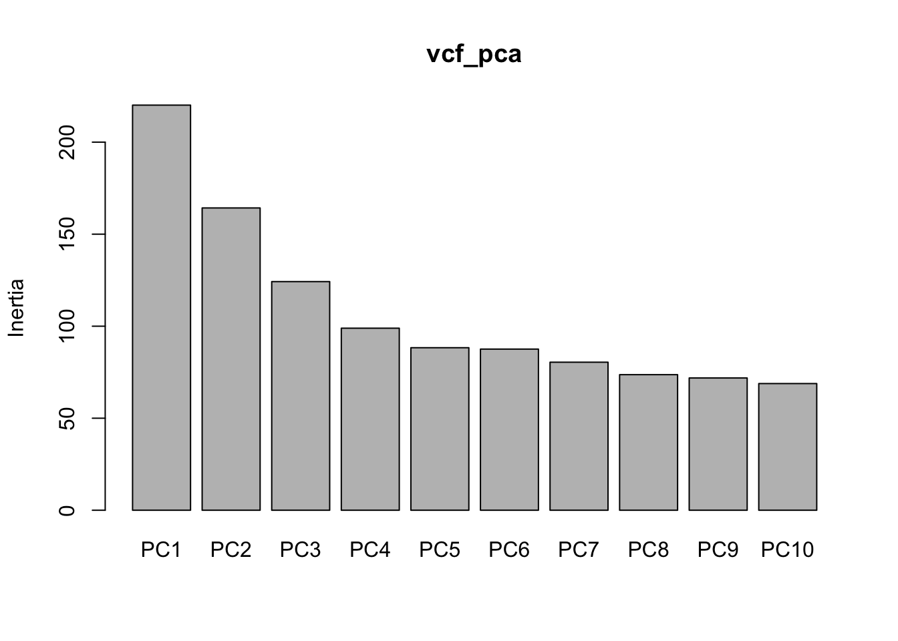
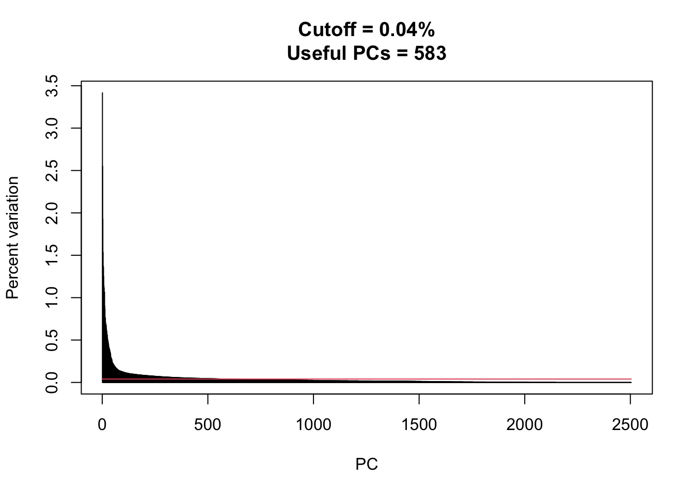
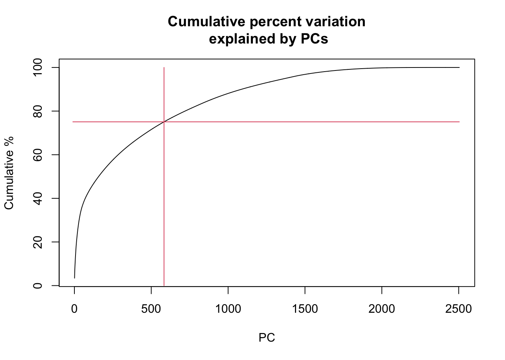
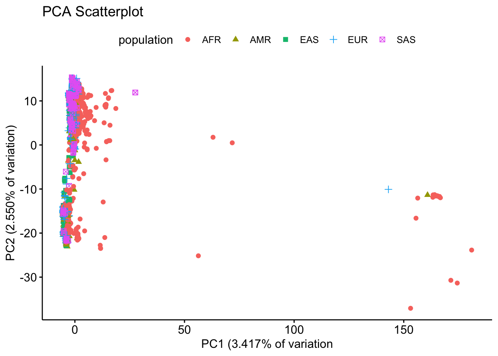
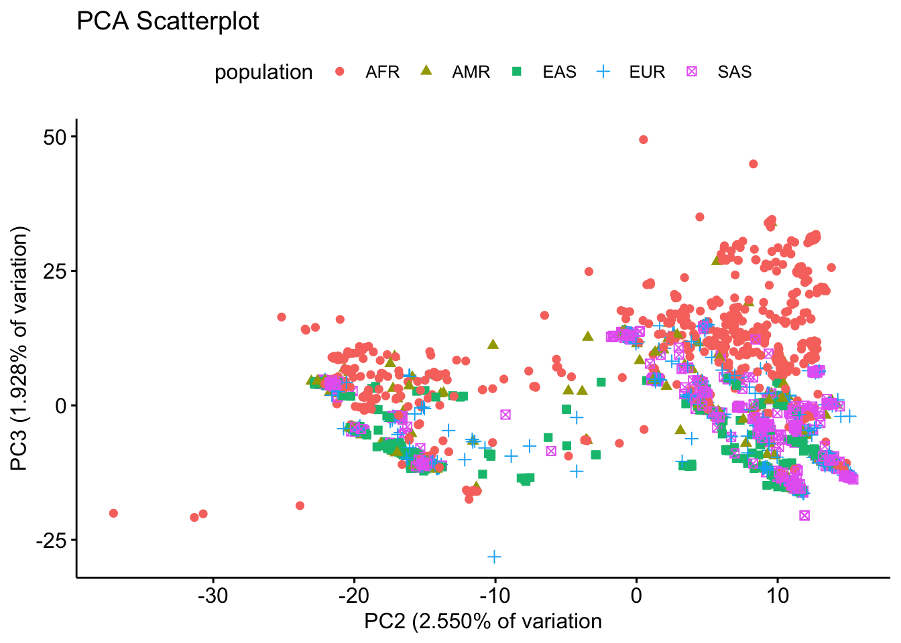
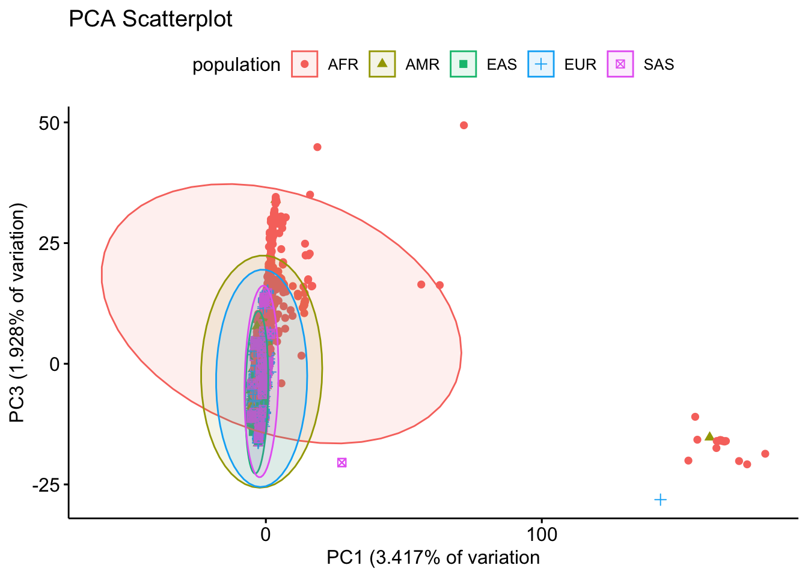
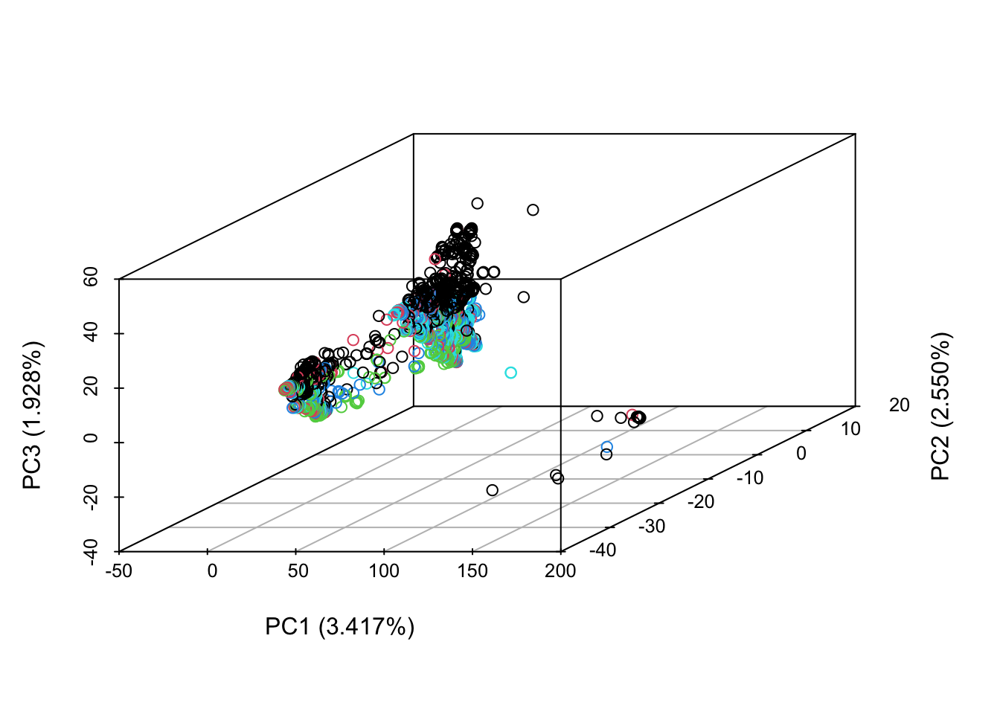

## Introduction

This report summarizes the analysis workflow and results of an analysis of SNPs from the **1000 Genomes Project**.

## Data preparation

### Obtaining and loading data

Single Nucleotide Polymorphism (SNPs) data in VCF format were obtained from the **1000 Genomes Project**.

SNPs were downloaded using the Ensembl Data Slicer from chromosome **17** between genomic coordinates **20809577** and **21049577**.  This represents **0.289%** of the chromosome.  A total of **8483 variants** genotyped in **2513** individuals were downloaded.
 
The VCF file was loaded into R using the `vcfR` package (function `read.vcfR`) and converted to counts of the minor allele using the function `vcfR::extract.gt()`.

### Data subsetting 

### Meta-data and sample information 

Meta data from 1000genomes_people_info2-1.csv was extracted and merged with variant genotypes downloaded from Ensembl Data Slicer. Meta data includes population abbreviations, super population, sample, sex, latitude and longitude.

### Data cleaning

These SNPs were then screened for any SNPs that were **invariant** (fixed), resulting in removal of **2041** SNPs (features).  This was done using the `invar_omit()` function by Nathan Brouwer.

**NOTE**: The original workflow code for removing invariant SNPs contained and error that resulted in **no columns** actually being removed (*Brouwer, personal communication*).  The code was updated and a reduction in the size of the dataframe after omitting invariant columns confirmed by checking the dimensions of the dataframes before and after this process using `dim()`.

The data were then screened for rows (people) with >50% NAs.  There were **no NAs** in the data, so no rows were removed due to the presence of excessive NAs. Similarly, because no NAs were present no imputation was required.

The data were then **centered and scaled** using R's `scale()` function.  (Alternatively a SNP-specific centering technique common in other studies could have been applied).

The data were then saved in `.csv` format using `write.csv()` for PCA analysis.

After final processing the data contained **6442 SNPS** and 2513 samples (people).

## Data Analysis

The code below carries out a PCA on the data and presents the results.  The key steps are:

1. Load the data with `read.csv()`.
1. Process the data with `prcomp()`.
1. Extract **PCA scores**.
1. Carry out **PCA diagnostics**, including construction of a scree plot.
1. Plot PCs 1 through 3 as **scatterplots** as pairwise scatterplot.
1. Plots PCS 1 through 3 as a 3D scatterplot.

### Packages

The following packages were used in this analysis:

```{r}
library(ggplot2)
library(ggpubr)
library(vegan)
library(scatterplot3d)
```

### Loading data

Load the fully processed data:

**NOTE:** with **~6442** SNPs, this CSV is ~**319** megabytes. There are more specialized packages for doing PCA with datasets this big. I do not recommend working with more than 10,000 SNPs with basic R functions as we have done in class.

```{r}
getwd()
```

```
## [1] "/Users/ethanfrank/Desktop/R/Final Project"
```

```{r}
vcf_scaled <- read.csv(file = "vcf_scaled.csv")
```

Check the dimensions of the data to confirm this is the correct data:

```{r}
dim(vcf_scaled)
```

```
## [1] 2504 6448
```

## Principal Components Analysis

The data are scaled and ready for analysis.  Only the **first six** columns contain character data and needs to be omitted.

```{r}
head(vcf_scaled[,1:6])
```

```
##    sample pop super_pop    sex      lat       lng
## 1 HG00096 GBR       EUR   male 52.48624 -1.890401
## 2 HG00097 GBR       EUR female 52.48624 -1.890401
## 3 HG00099 GBR       EUR female 52.48624 -1.890401
## 4 HG00100 GBR       EUR female 52.48624 -1.890401
## 5 HG00101 GBR       EUR   male 52.48624 -1.890401
## 6 HG00102 GBR       EUR female 52.48624 -1.890401
```

### PCA

Principal Components Analysis was run using `prcomp()`.

```{r}
vcf_pca <- prcomp(vcf_scaled[, -c(1:6)])
```

Get the PCA **scores**, which will be plotted:

```{r}
vcf_pca_scores  <- vegan::scores(vcf_pca) 
```

Combine the scores with the sample information into a dataframe.

```{r}
vcf_pca_scores2 <- data.frame(population = vcf_scaled$super_pop,
                              vcf_pca_scores)

vcf_pca_scores2$population <- factor(vcf_pca_scores2$population)
```

### PCA diagnostics

The following steps help us understand the PCA output and determine how many PCs should be plotted and/or used in further analyses such as scans for natural selection, cluster analysis, and GWAS.

#### Default scree plot

A default R scree plot was created with `screeplot().`  This plot does not provide extra information for assessing the importance of the PCs.

```{r}
screeplot(vcf_pca, 
          xlab = "Principal Components")
```



#### Advanced scree plot

The original workflow and function for making a more advanced scree plot lacked flexibility (*Brouwer, personal communication*). The following function and workflow simplifies things

1. Run PC (done above)
1. Call function `PCA_variation()` (below) on PCA output.
1. (Do NOT call summary() on PCA output)
1. Call function `screeplot_snps()` on the output of `PCA_variation()` to make an advanced scree plot
1. Call function `PCA_cumulative_var_plot()` to show the cumulative variation explained as more PCs are considered

##### NEW Functions

###### PCA_variation() function

This function extracts information needed to make a more advanced, annotated scree plot.

```{r}
PCA_variation <- function(pca) {
  
  # get summary information from PCA
  pca_summary <- summary(pca)
  
  # extract information from summary
  ## raw variance for each PC
  variance <- pca_summary$importance[1,]
  
  ## % variance explained by each PC
  var_explained <- pca_summary$importance[2,]*100
  var_explained <- round(var_explained,3)
  
  ## cumulative % variance  
  var_cumulative <- pca_summary$importance[3,]*100
  var_cumulative <- round(var_cumulative,3)
  
  # prepare output
  N.PCs <- length(var_explained)
  var_df <- data.frame(PC = 1:N.PCs,
            var_raw  = variance,
            var_percent = var_explained, 
            cumulative_percent = var_cumulative)
  
  # return output
  return(var_df)
  
}
```

###### screeplot_snps() function

This functions makes a more advanced scree plot better suited for PCS on for SNPs.

```{r}
# This is a NEW function
screeplot_snps <- function(var_df) {

 total_var <- sum(var_df$var_raw)
 N <- length(var_df$var_raw)
 var_cutoff <- total_var/N
 var_cut_percent <- var_cutoff/total_var*100
 var_cut_percent_rnd <- round(var_cut_percent,2)
 i_above_cut <- which(var_df$var_percent > var_cut_percent)
 i_cut <- max(i_above_cut) 
 ti <- paste0("Cutoff = ",
             var_cut_percent_rnd,
             "%\n","Useful PCs = ",i_cut)
             
 plot(var_df$var_percent,
         main =ti, type = "l",
      xlab = "PC",
      ylab = "Percent variation",
      col = 0)

 segments(x0 = var_df$PC,
          x1 = var_df$PC,
          y0 = 0, 
          y1 = var_df$var_percent,
          col = 1)

 segments(x0 = 0,
          x1 = N,
          y0 = var_cut_percent, 
          y1 = var_cut_percent,
          col = 2)
         
}
```

###### PCA_cumulative_var_plot() function

This makes a plot complementary to a scree plot.  A scree plot plots the amount of variation explained by each PC.  This plot plots a curve of cumulative amount of  variation explained by the PCs.   

```{r}
# This is a NEW function
PCA_cumulative_var_plot <- function(var_df) {

 plot(cumulative_percent ~ PC, 
      data = var_out,
      main = "Cumulative percent variation\n explained by PCs",
      xlab = "PC",
      ylab = "Cumulative %",
      type = "l")
  
 total_var <- sum(var_df$var_raw)
 N <- length(var_df$var_raw)
 var_cutoff <- total_var/N
 var_cut_percent <- var_cutoff/total_var*100
 var_cut_percent_rnd <- round(var_cut_percent,2)
 i_above_cut <- which(var_df$var_percent > var_cut_percent)
 i_cut <- max(i_above_cut) 

 percent_cut_i <- which(var_out$PC == i_cut )
 percent_cut <- var_out$cumulative_percent[percent_cut_i]
 segments(x0 = i_cut,
          x1 = i_cut,
          y0 = 0, 
          y1 = 100,
          col = 2)

 segments(x0 = -10,
          x1 = N,
          y0 = percent_cut, 
          y1 = percent_cut,
          col = 2)

}
```

##### Advanced screeplot analysis

###### Extract information

Extract information on the variance explained by each PC.
```{r}
var_out <- PCA_variation(vcf_pca)
```

Look at the output of `PCA_variation()`
```{r}
head(var_out)
```

```
##     PC   var_raw var_percent cumulative_percent
## PC1  1 14.836249       3.417              3.417
## PC2  2 12.815931       2.550              5.967
## PC3  3 11.145918       1.928              7.895
## PC4  4  9.945877       1.536              9.431
## PC5  5  9.397170       1.371             10.801
## PC6  6  9.357098       1.359             12.160
```

###### Advanced screeplot

This advanced scree plot shows the amount of variation explained by all PCs. It marks with a horizontal line what the cutoff is for the amount of Percent variation explained that is useful, and a vertical line for where that line interacts the curve of the scree plot.  The title indicates the percentage value of the cutoff and which PC is the last PC below that value.  Though only the first few PCs can be plotted, PCs below the cut off value ("useful PCs) should probably used for further machine learning algorithms.

Make the scree plot with `screeplot_snps()`

```{r}
screeplot_snps(var_out)
```



###### Cumulative variation plot

The cumulative variation plot shows how much variation in the data explained in total as more and more PCs are considered.  The vertical red line shows the cutoff value from the scree plot (above).  The horizontal line indicates what the total percentage of variation explained by these useful PCs is.

Make cumulative variation plot with `PCA_cumulative_var_plot()`

```{r}
PCA_cumulative_var_plot(var_out)
```



### PCA Scatterplots

The object created above `var_out` indicates how much variation is explained by each of the Principal components.  This information is often added to the axes of scatterplots of PCA output.  

```{r}
head(var_out)
```

```
##     PC   var_raw var_percent cumulative_percent
## PC1  1 14.836249       3.417              3.417
## PC2  2 12.815931       2.550              5.967
## PC3  3 11.145918       1.928              7.895
## PC4  4  9.945877       1.536              9.431
## PC5  5  9.397170       1.371             10.801
## PC6  6  9.357098       1.359             12.160
```

PC 1 explains 3.417% percent of the variation, PC2 explains. 2.550%, and PC3 explains 1.928%.  In total, the first 3 PCs explain only ~7.9% of the variability in the data.  The scree plot indicate that the first ~600 PCs are useful explain ~75% of the variation in the data.  In further analysis such as GWAS the first 600 PCs should therefore be used.

#### Plot PC1 versus PC2

Plot the scores, with super-population color-coded
```{r}
ggpubr::ggscatter(data = vcf_pca_scores2,
                  y = "PC2",
                  x = "PC1",
              color = "population",
              shape = "population",
              main = "PCA Scatterplot",
         ylab = "PC2 (2.550% of variation)",
         xlab = "PC1 (3.417% of variation")
```



Note how in the plot the amount of variation explained by each PC is shown in the axis labels.

#### Plot PC2 versus PC3

Plot the scores, with super population color-coded
```{r}
ggpubr::ggscatter(data = vcf_pca_scores2,
                  y = "PC3",
                  x = "PC2",
                  color = "population",
                  shape = "population",
                  main = "PCA Scatterplot",
          ylab = "PC3 (1.928% of variation)",
          xlab = "PC2 (2.550% of variation")
```



Note how in the plot the amount of variation explained by each PC is shown in the axis labels.


#### Plot PC1 versus PC3

Plot the scores, with super population color-coded
```{r ggscatter3}
ggpubr::ggscatter(data = vcf_pca_scores2,
                  y = "PC3",
                  x = "PC1",
                  ellipse = T,
            color = "population",
            shape = "population",
            main = "PCA Scatterplot",
      ylab = "PC3 (1.928% of variation)",
      xlab = "PC1 (3.417% of variation")
```



Note how in the plot the amount of variation explained by each PC is shown in the axis labels.

### 3D scatterplot

The first 3 principal components can be presented as a 3D scatterplot.

```{r}
colors_use <- as.numeric(vcf_pca_scores2$population)
scatterplot3d(x = vcf_pca_scores2$PC1,
              y = vcf_pca_scores2$PC2,
              z = vcf_pca_scores2$PC3,
  color = colors_use,
              xlab = "PC1 (3.417%)",
              ylab = "PC2 (2.550%)",
              zlab = "PC3 (1.928%)")
```



AFR seems to very variable and not much correlation between any of the PCs.
